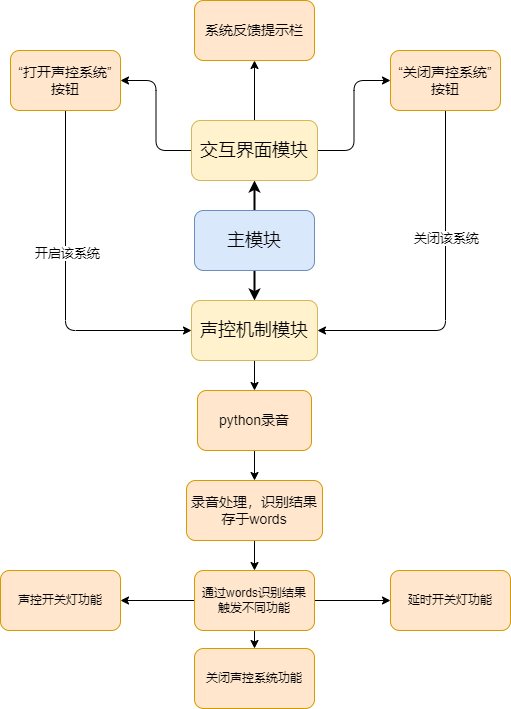

# SRS

## 项目说明

该项目是利用佛山微风科技的MODBUS-485继电器模块与百度语音识别实现的一套基于声控的电灯控制系统，该套系统基于python开发设计，其中用到的界面设计也是用python开发的。

该项目为用户语音输入，程序判断语音输入的指令中是否含有开灯关灯字样来控制485模块中继电器的开合从而控制电灯的开关，同时还实现了以秒为单位的延迟开关指令。

## 功能流程图展示

## 整体功能技术说明

1.由于百度语音识别系统需要上传音频文件来识别语音，所以首先得利用python来实现录音，python录音需要用到PyAudio库来实现，首先需要创建一个PyAudio对象，用该对象创建一个流stream并指定采样位，声道数，采样频率，并用wave来打开一个音频文件wf，同样设置采样位，声道数，采样频率。然后用流stream来读取用户录音的声音，用wf来写入音频文件。得到音频文件后，调用百度语音识别接口来实现语音识别，此处参考百度给的技术文档即可。实现录音功能写入get_audio(sec)函数中，sec为录音的时间，单位是秒，调用百度语音识别的功能写入get_words()函数中，语音识别的内容会放入words中。

2.接下来是连接MODBUS-485继电器模块，连接模块的原理是读取成功读取模块输入寄存器和保持寄存器，根据该模块的协议为MODBUS-RTU以及该模块的技术文档，调用modbus_tk库来初始化设备的波特率校验方式，和停止位，然后分别使用指令0x04和0x03来对输入寄存器和保持寄存器操作，达到连接模块的效果。将此方法写入Init(port)函数中,port为端口号。实现代码控制继电器模块中线圈的接通或者断开，从而控制电流的流向，最终达到控制电灯是否开启。通过技术文档得到控制该继电器模块中单个线圈的指令为0x05，状态常量中输入0XFF00为连接，0x0000为断开，模块线圈的默认起始地址为0x00，仍然用modbus_tk来实现对继电器模块进行对单个线圈的操作。上述功能由Switch(master，action)函数实现，master为主机对象，action变量用来控制继电器开合，action=on时连通，action=off时断开。

3.接下来是声控系统的执行函数start()，首先调用上述Init(port)初始化函数来对模块初始化，调用get_audio(sec)和get_words()函数来对语音内容进行识别操作，根据words中的内容来进行不同的操作含有“开灯”字眼的调用switch()函数将action的值设为on便可打开灯，若是“关灯”字眼的便将action的值设为off，即可关灯。start()函数中还是实现了延时开关灯的功能，该功能是将get_words()得到的words进行正规匹配，将其中的数字提取出来放入ans变量中，由于百度语音识别会将识别出的1-10的数字转为汉字，故建立了一个键值对数组用于对数字进行转换。提取出来后将变量ans的值转为int类型，然后调用time库里的sleep()函数将ans传入进去，通过线程等待的方式来实现延时开关。

4.最后是交互界面，该项目的交互界面是调用PySimpleGUI库来实现的，右上角设置一个退出按钮来退出程序，设置Text文本来写明系统介绍，两个按钮button来实现整个声控系统的开关和一个输出文本框Output来实现反馈。当单击按钮“打开声控系统”后便会调用start()函数来进行核心操作，但是因为是在主线程执行的GUI界面，在点击“打开声控系统”按钮后跳入其他函数来执行所需操作，此时GUI界面会由于整个主线程在执行另外一个许久不会结束的函数，整个GUI界面不在刷新出现未响应，为了解决此问题，需要将声控系统的主执行函数start()在子线程中执行，只要不影响主线程执行，GUI便可以继续刷新并且可以得到声控系统的反馈信息显示出来。

